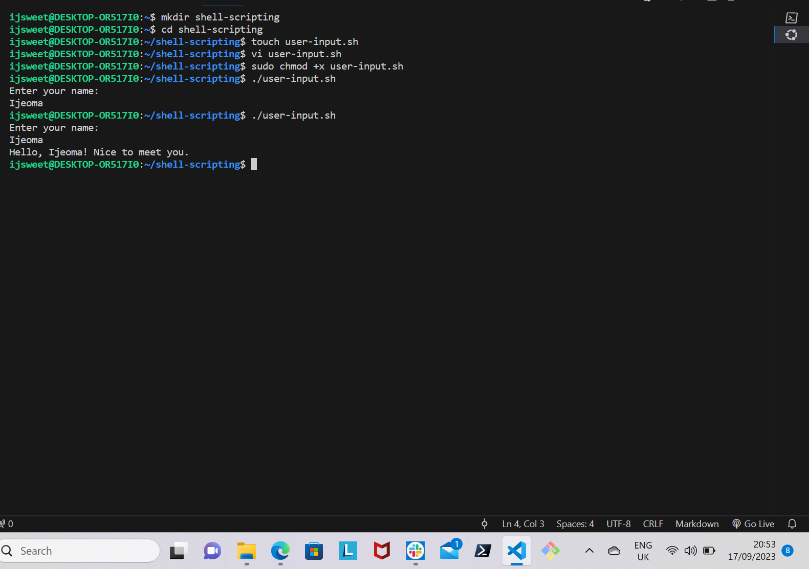
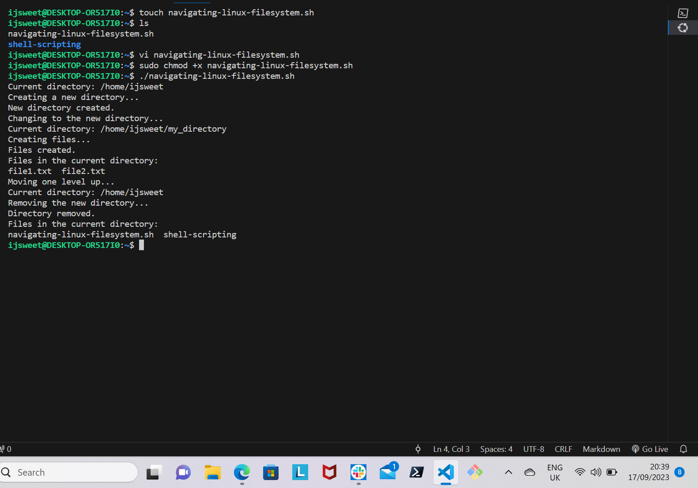
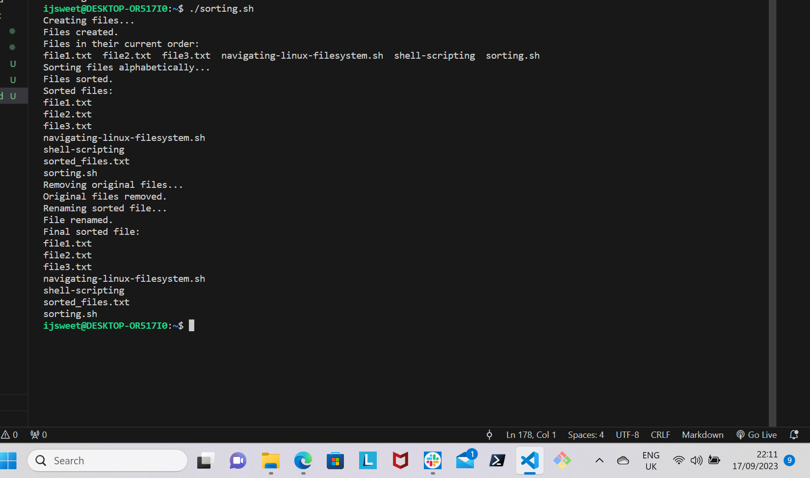
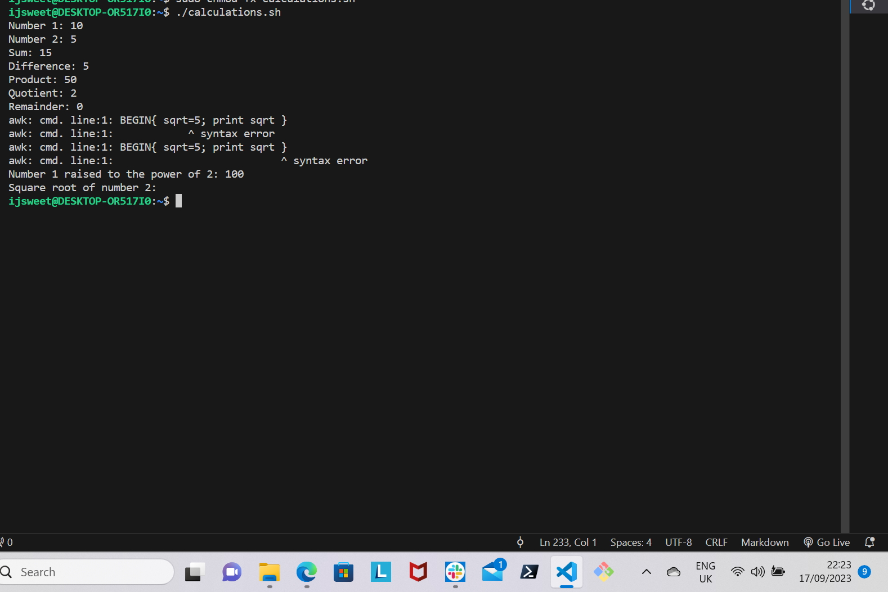
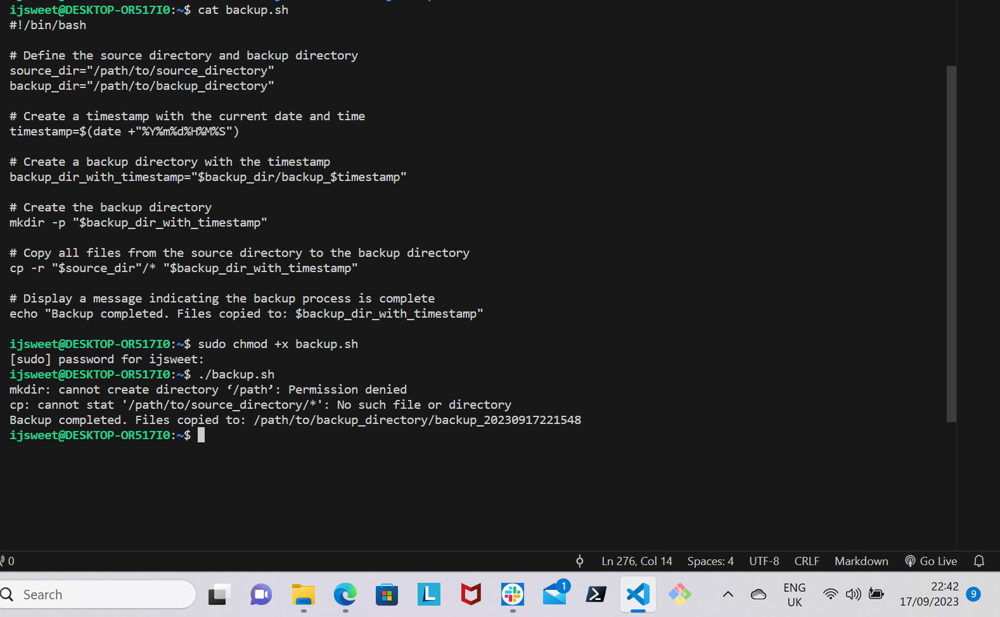

# SHELL SCRIPTING

## Requirements
- Have a terminal in your computer

FIRST SCRIPT

Step 1: On your terminal, create a folder *shell-scripting* by using this command:

```python
'mkdir shell-scripting'
```
Step 2: open a file called user-input.sh with this command:

```python
'touch user-input.sh'
```

Step 3: Open the file using any text editor of your choice. Run this command:

```python
'vi user-input.sh'
```
Paste the below block of code inside the file:

```python
'#!/bin/bash

# Prompt the user for their name
echo "Enter your name:"
read name

# Display a greeting with the entered name
echo "Hello, $name! Nice to meet you."'
```

Step 4: Save your file.

Step 5: Type in the below command so as to make the file executable.

```python
'sudo chmod +x user-input.sh'
```

Step 6: Use this command to run the script:

```python
'./user-input.sh'
```



DIRECTORY MANIPULATION AND NAVIGATION

Step 1: Create a file called *navigating-linux-filesystem.sh*

Step 2: Open the file with a text editor.

```python
'vi navigating-linux-filesystem.sh'
```
Paste inside the file the below block of code:

```python
'#!/bin/bash

# Display current directory
echo "Current directory: $PWD"

# Create a new directory
echo "Creating a new directory..."
mkdir my_directory
echo "New directory created."

# Change to the new directory
echo "Changing to the new directory..."
cd my_directory
echo "Current directory: $PWD"

# Create some files
echo "Creating files..."
touch file1.txt
touch file2.txt
echo "Files created."

# List the files in the current directory
echo "Files in the current directory:"
ls

# Move one level up
echo "Moving one level up..."
cd ..
echo "Current directory: $PWD"

# Remove the new directory and its contents
echo "Removing the new directory..."
rm -rf my_directory
echo "Directory removed."

# List the files in the current directory again
echo "Files in the current directory:"
ls'
```

Step 3: To give the file permission to execute, run this command:

```python
'sudo chomd +x navigating-linux-filesystem.sh'
```

Step 4: Run the script using this command:

```python
'./navigating-linux-filesystem.sh'
```



FILE OPERATIONS AND SORTING

Step 1: On your terminal, create a file named *sorting.sh.* run this command:

```python
'touch sorting.sh'
```

Step 2: Open the file and paste the below block of code:

```python
'#!/bin/bash

# Create three files
echo "Creating files..."
echo "This is file3." > file3.txt
echo "This is file1." > file1.txt
echo "This is file2." > file2.txt
echo "Files created."

# Display the files in their current order
echo "Files in their current order:"
ls

# Sort the files alphabetically
echo "Sorting files alphabetically..."
ls | sort > sorted_files.txt
echo "Files sorted."

# Display the sorted files
echo "Sorted files:"
cat sorted_files.txt

# Remove the original files
echo "Removing original files..."
rm file1.txt file2.txt file3.txt
echo "Original files removed."

# Rename the sorted file to a more descriptive name
echo "Renaming sorted file..."
mv sorted_files.txt sorted_files_sorted_alphabetically.txt
echo "File renamed."

# Display the final sorted file
echo "Final sorted file:"
cat sorted_files_sorted_alphabetically.txt'
```

Step 3: Give the file permission to execute, run:

```python
'sudo chmod +x sorting.sh'
```

Step 4: Run the script using this command:

```python
'./sorting.sh'
```



WORKING WITH NUMBERS AND CALCULATIONS

Step 1: Open your terminal and create a file named *calculations.sh* by typing this command:

```python
'touch calculations.sh'
```
Step 2: Open the file with a text editor and paste the below code block:

```python
'#!/bin/bash

# Define two variables with numeric values
num1=10
num2=5

# Perform basic arithmetic operations
sum=$((num1 + num2))
difference=$((num1 - num2))
product=$((num1 * num2))
quotient=$((num1 / num2))
remainder=$((num1 % num2))

# Display the results
echo "Number 1: $num1"
echo "Number 2: $num2"
echo "Sum: $sum"
echo "Difference: $difference"
echo "Product: $product"
echo "Quotient: $quotient"
echo "Remainder: $remainder"

# Perform some more complex calculations
power_of_2=$((num1 ** 2))
square_root=$(awk "BEGIN{ sqrt=$num2; print sqrt }")

# Display the results
echo "Number 1 raised to the power of 2: $power_of_2"
echo "Square root of number 2: $square_root"'
```

Step 3: Set execute permission on the file using this command:

```python
'sudo chmod +x calculations.sh'
```
Step 4: Run the script using this command: 

```python
'./calculations.sh'
```



FILE BACKUP AND TIMESTAMPING

Step 1: Open your terminal and create a file called *backup.sh *using this command:

```python
'touch backup.sh'
```
Step 2: Using a text editor, open the file and paste the below code block:

```python
'#!/bin/bash

# Define the source directory and backup directory
source_dir="/path/to/source_directory"
backup_dir="/path/to/backup_directory"

# Create a timestamp with the current date and time
timestamp=$(date +"%Y%m%d%H%M%S")

# Create a backup directory with the timestamp
backup_dir_with_timestamp="$backup_dir/backup_$timestamp"

# Create the backup directory
mkdir -p "$backup_dir_with_timestamp"

# Copy all files from the source directory to the backup directory
cp -r "$source_dir"/* "$backup_dir_with_timestamp"

# Display a message indicating the backup process is complete
echo "Backup completed. Files copied to: $backup_dir_with_timestamp"'
```

Step 3: Set execute permission on the file by running this command:

```python
'sudo chmod +x backup.sh'
```

To run the script, use this command:

```python
'./backup.sh'
```

